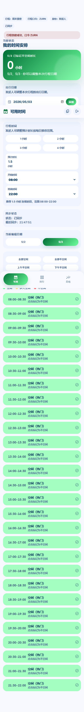
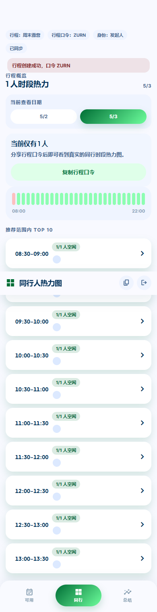
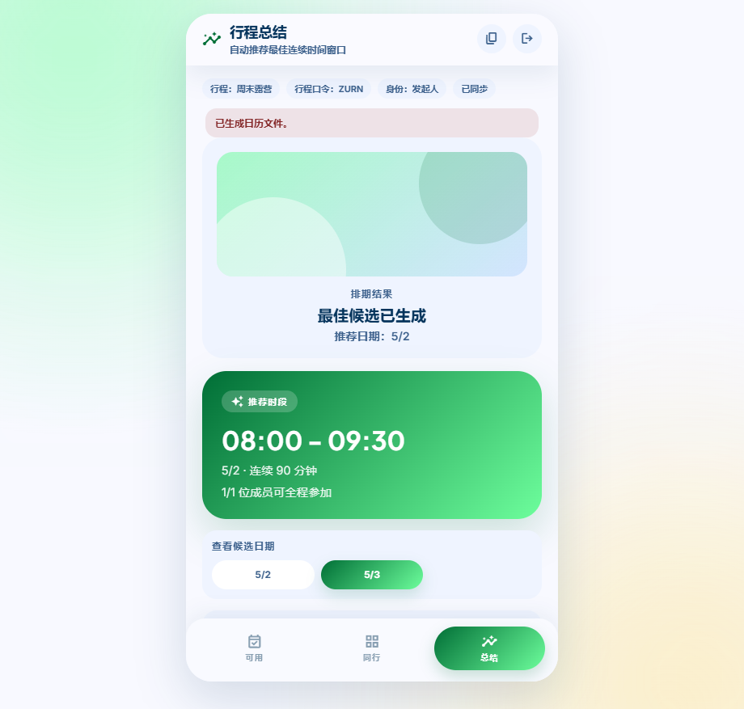

# Team Time

[English](README.md) | 简体中文

## 概览

Team Time 是一个移动端优先的小团队出游排期 Web 应用。发起人创建行程，设置候选日期、预计时长和每日推荐时间范围。成员使用短行程口令加入，按日期标记自己的可用时间，应用会自动生成同行热力图、最佳连续时间窗口，并支持导出 `.ics` 日历文件。

## 功能

- 使用短口令创建或加入行程，方便分享。
- 由发起人管理行程名称、候选日期、预计时长和每日推荐范围。
- 每位成员按候选日期编辑 30 分钟粒度的可用时段，默认空闲，点击即可标记不空闲。
- 同步本机浏览器会话中的编辑结果，并在多人加入后展示同行热力图。
- 跨所有候选日期计算最佳连续时间窗口，并导出为日历文件。

## 界面截图

| 可用时间 | 热力图 | 总结 |
| --- | --- | --- |
|  |  |  |

## 技术栈

- 前端：原生 `index.html`、`app.js` 和 `styles.css`
- 后端：`server.js` 中的原生 Node.js HTTP 服务
- 数据库：Node.js 内置 `node:sqlite`，文件数据库为 `team-time.db`
- 运行时依赖：无第三方运行时依赖

## 本地开发

项目需要 Node.js `v24+`，因为使用了内置的 `node:sqlite` 模块。

```bash
npm install
npm run dev
```

默认访问地址：

- Web：`http://localhost:4173`
- 健康检查：`http://localhost:4173/api/health`

可选环境变量：

- `HOST`：监听地址，默认 `0.0.0.0`
- `PORT`：服务端口，默认 `4173`
- `DATA_DIR`：数据库目录，默认 `data`

## 验证

```bash
npm run check
npm run smoke:api
npm run test:e2e
```

也可以一次性运行完整验证套件：

```bash
npm run verify
```

检查覆盖内容：

- `check`：验证 `server.js`、`app.js` 和测试脚本的语法。
- `smoke:api`：启动临时服务，验证健康检查、创建行程、加入行程、多日期可用时间、发起人权限、非默认端口、临时 `DATA_DIR` 和重启后的数据持久化。
- `test:e2e`：运行移动端优先的 Playwright 流程，覆盖创建、加入、日期切换、标记不空闲、热力图、总结页和 `.ics` 下载入口，并将截图写入 `test-results/e2e/`。

首次运行 Playwright 前，如果本机没有可用的 Chrome 或 Edge，请先安装浏览器：

```bash
npm run browsers:install
```

如需使用指定浏览器可执行文件，请设置：

```bash
PLAYWRIGHT_EXECUTABLE_PATH=/path/to/chrome-or-edge
```

测试数据会写入 `.tmp-smoke-data/`。脚本会清理该目录，并且它已经列入 `.gitignore`。

## Docker 部署

构建生产镜像：

```bash
docker build -t team-time:local .
```

直接运行容器：

```bash
docker run -d --name team-time -p 4173:4173 -v team-time-data:/app/data team-time:local
```

推荐使用 Docker Compose 启动服务：

```bash
docker compose up -d --build
```

使用自定义宿主机端口：

```bash
HOST_PORT=8080 docker compose up -d --build
```

常用操作：

```bash
docker compose logs -f
docker compose down
```

默认访问地址为 `http://localhost:4173`，健康检查为 `http://localhost:4173/api/health`。容器内服务端口固定为 `4173`，数据目录固定为 `/app/data`。

Compose 会将数据库持久化到 named volume `team-time-data`。删除容器或运行 `docker compose down` 不会删除行程数据。如果删除该 volume，`team-time.db` 和所有行程数据也会一并删除。

## 公开部署

请部署到可运行 Node.js 24+ 且提供持久磁盘存储的平台，例如 Render、Railway、Fly.io 或 VPS。不要部署到纯静态托管，因为应用需要后端 API 和 SQLite 数据库。

推荐环境变量：

```bash
HOST=0.0.0.0
PORT=<平台分配端口>
DATA_DIR=/persistent/team-time-data
```

部署注意事项：

- `DATA_DIR` 必须指向持久磁盘或持久卷，否则服务重启后行程数据会丢失。
- 数据库文件会自动创建在 `${DATA_DIR}/team-time.db`。
- 启动命令使用 `npm start`。
- 部署后先访问 `/api/health`，再完整走一次创建和加入行程流程。

## API 约定

保留的公开接口：

- `GET /api/health`
- `POST /api/teams`
- `POST /api/teams/join`
- `GET /api/teams/:code`
- `PATCH /api/teams/:code?memberId=...`
- `PUT /api/teams/:code/members/:id/availability`

`team` 响应包含 `tripDates`、`durationMinutes`、`dayStartMinutes` 和 `dayEndMinutes`。成员响应包含 `availabilityByDate`。只有 `role === "发起人"` 的成员可以通过 `PATCH /api/teams/:code?memberId=...` 更新行程设置。

## 数据库

- 默认数据目录：`data`
- 默认数据库路径：`data/team-time.db`
- 表：`teams`、`members`、`availabilities`
- 服务启动时会自动创建缺失表，并将旧版单日期 availability 数据迁移到多日期结构。
